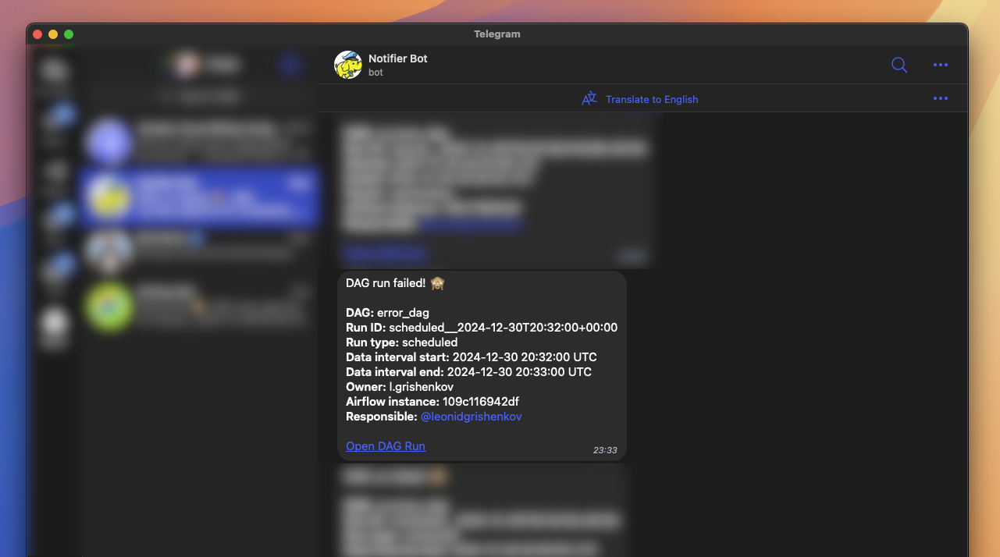

# About

This plugin will send notifications in Telegram via official Telegram Rest API about Airflow DAGs state.

Currently notifications will be send:

1. When any DAG failed;
2. When manually triggered DAG completed successfully.

If DAG failed:



If manual DAG completed:


# Deploy Airflow

Get official Airflow docker compose file:

```sh
curl -Lfo ./docker/compose.yaml 'https://airflow.apache.org/docs/apache-airflow/2.10.3/docker-compose.yaml'
```

Start Airflow containers:

```sh
docker compose -f ./docker/compose.yaml up -d
```

To stop containers type:

```sh
docker compose -f ./docker/compose.yaml down
```

# Adding plugins

Add plugins into the `./airflow/plugins` forlder.

Then restart webserver and scheduler Airflow components:

```sh
docker restart airflow-webserver airflow-scheduler
```
